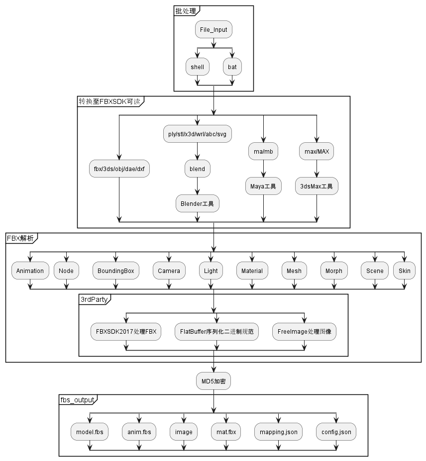
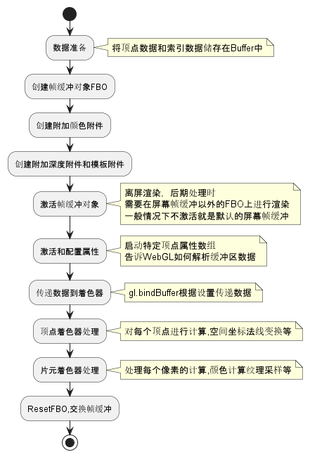
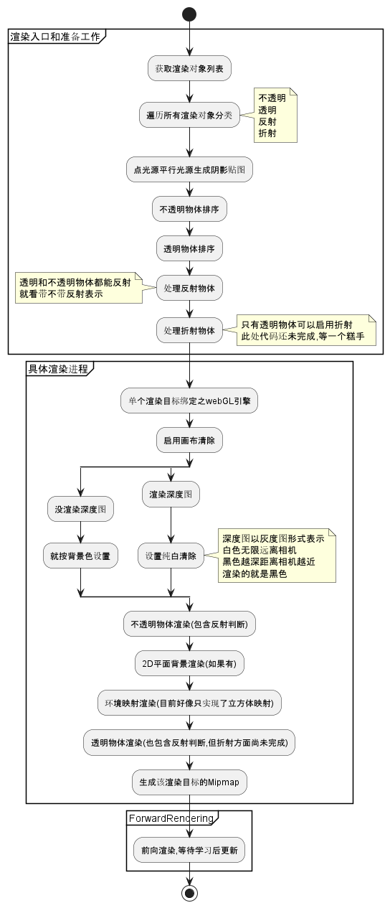
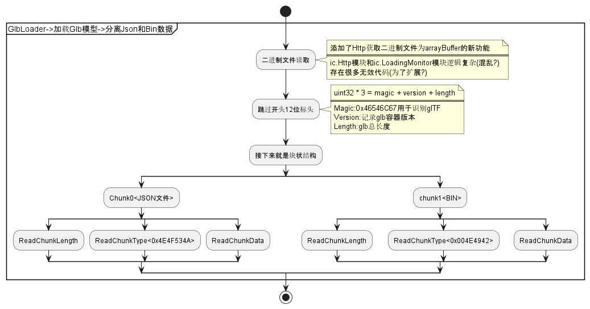

# Bowell_Engine 学习文档

## 一.文档结构

欢迎来到 Bowell_DT 机密，阅览之前请先签署保密协议。
各个部分以 PlantUml 流程图为主体引导。
其余作为概念介绍，详细情况请阅读源代码。

### 1.知识储备

文档由 MarkDown 编写，流程图由 PlantUml 编写。

#### 1. Bowell_DT 格式转换器主体由 C++编写。

另外还涉及 Window 下的.bat 批处理命令。
以及 Linux 下的.sh 的 Shell 命令行处理。
第三方库使用 FBXSDK2017 处理模型数据
FlatBuffer 序列化数据至二进制模式，用于传输
FreeImage 处理图像等
最后执行程序由 CMakeLists 负责编译。

#### 2. Bowell_DT ICreator 底层引擎由 Javascript 编写

采用 IIFE 模式解耦各个模块
ES5 标准

#### 3. Bowell_DT Editor 编辑器引擎由 Javascript 编写

## 二.格式转换器

### 1.模型输入分流

fbs.bat 批处理程序运行在 windows 系统下
批处理程序自动根据输入的文件类型调用 3 个不同的工具
目标是得到统一的 FBX 格式文件

export.sh shell 程序运行于 Linux 系统下
批处理程序自动根据输入的文件类型调用 3 个不同的工具
目标是得到统一的 FBX 格式文件

### 2.第三方工具转 FBX

对于无法直接被 Bw_Exporter 处理的格式，通过调用以下三个工具进行格式转换至 FBX 格式

1. Blender 工具处理: ply/stl/x3d/wrl/abc/svg
2. Maya 工具处理: ma/mb
3. 3DMAX 工具处理: max/MAX

### 3.FBX 解析

#### 3.1 FBXSDK 介绍

FBX 格式不开源，只能通过 FBXSDK 处理 FBX 模型，Bw_Exporter 使用 FBXSDK2017

#### 3.2 数据解包

##### 3.2.1 Animation

##### 3.2.2 Node

##### 3.2.3 Camera

##### 3.2.4 BoundingBox

##### 3.2.5 Scene

##### 3.2.6 Light

##### 3.2.7 Material

##### 3.2.8 Mesh

##### 3.2.9 Morph

##### 3.2.10 Skin

### 4.MD5 加密

### 5.FreeImage 处理

### 6.FlatBuffers 序列化

#### 6.1 Schema 定义

#### 6.3 输出文件

## 三.ICreator 底层引擎

### 1.设计结构

IIFE 设计模式，ES5，分离模块设计
(但是从实际代码来看并没有实现解耦)
(后续需要添加一个消息系统<有但是没应用>来统一管理组件之间的互相通信)

#### 1.1 功能改动如何编译运行测试？

src 文件夹下有 Build 和 Samples 两个文件夹
build 负责所有的模块打包和处理
Samples 包含一些测试用的文件

##### 1.1.1 build

注意：
Build 之前需要在 chunks.json 中添加新着色代码的路径
Build 之前需要在 icreator3d.json 中添加新模块路径

##### 1.1.2 Samples

index.html 负责在网页端展示效果
index.js 负责具体的功能调试
注意：
调试新功能前需要先 Build 项目，更新引用的 ICreator.js 库

### 2.Animation 模块

### 3.AR 模块

### 4.Audio 模块

### 5.Basic 通用模块

#### 5.1 性能检测

### 6.Camera 模块

#### 6.1 相机模式

##### 6.1.1 Ortho 正交相机

##### 6.1.2 Perspective 投影相机

##### 6.1.3 Target 目标相机

#### 6.2 相机控制

##### 6.2.1 ArcBall/InertiaArcBall 鼠标球

##### 6.2.2 FirstPerson 第一人称

##### 6.2.3 Gyro 陀螺仪

### 7.Core 核心模块

#### 7.1 WebGL 调用

1.获取 webGL 上下文

2.获取兼容性信息(支持的各种参数的最大值)

3.解码 ShaderChunks

##### 7.2.1 WebGL 初始化

1.基础设置
清屏模式(颜色，深度，模板)
<清屏模式由位掩码表示，可以同时表示三种参数的状态>
清平颜色(RGBA)
开启深度缓冲
设置深度缓冲类型 LEQUAL
激活多边形正反面剔除功能
设置剔除面为背面

2.缓冲区 Buffer 设置
创建缓冲区 createBuffer(只生成缓冲对象标识，尚未在显存内分配空间)
绑定缓冲区 bindBuffer(告诉管线相关数据的持有对象，要数据就找这个缓冲对象)
设置缓冲区 bufferData(真正给缓冲区对象分配显存空间，并将 CPU 数据传递至 GPU)
更新缓冲区 bufferSubData(更新已经存在的缓冲对象 BO 中的部分数据)

3.着色器 Shader 设置
创建 Shader 对象 createShader(选择 Vtx 或者 Frag，里面还啥都没有呢)
生成 Shader 源码 shaderSource(将外部着色器源码生成至 shader 对象中)
编译 Shader 源码 complieShader(编译 shader 对象至二进制机器语言)

#### 7.2 Instance3D 引擎实例

1.实例化 WebGLEngine

2.从场景获取渲染列表，划分成不透明队列和透明队列

3.透明队列有反射属性，不透明队列有反射和折射队列
注:折射代码尚未完成

4.透明队列和不透明队列的排序算法

5.深度渲染模块

6.法线贴图模块

7.前向渲染模块

#### 7.3 Scene 场景管理

1.创建环境节点

2.伽马模式

3.色调映射

4.曝光

5.灯光的管理
添加，更新，移除

6.节点树管理(底层结构在 Chapter15 Node 模块)
添加，移除，获取渲染队列，版本节点号

#### 7.5 第三方 SkyBox 环境

### 8.Effect 模块

### 9.Light 模块

#### 9.1 光源概览

#### 9.2 普通光源

##### 9.2.1 方向光

##### 9.2.2 点光源

##### 9.2.3 探照灯

#### 9.3 阴影光源

##### 9.3.1 方向光

##### 9.3.2 点光源

##### 9.3.3 探照灯

### 10.Loader 模块

#### 10.1 LoadingMonitor 概述

#### 10.2 EnvMapLoader 第三方环境

#### 10.3 FBSLoader/FlatBuffers

##### 10.3.1 AnimationLoader

##### 10.3.2 MaterialLoader

##### 10.3.3 ImageLoader

##### 10.3.4 TextureLoader

##### 10.3.5 ModelLoader

#### 10.4 GpuPreLoader

#### 10.5 HdrLoader

#### 10.6 ObjectLoader

#### 10.7 glTF2.0Loader(Ver2.0 update)

##### 10.7.1 二进制 glb 单文件加载

Section1：将二进制文件解析成 json(场景结构描述等)和 bin(模型数据等)两个文件

Section2：根据 json 结构创建 Mesh 节点树(剔除多余节点的全 MeshNode 树)
Section3：根据节点树的节点位置和 AABB 盒得到 renderList 之后，读取缓冲区数据

注：从 Sec1 开始是一个 Promise 链

##### 10.7.2 glTF 材质模型数据等各自单独文件的加载

##### 10.7.3 Draco 压缩版的 glTF 文件加载
  
##### 10.7.4 Embedded 嵌入式的 glTF 文件加载

### 11.Material 模块

#### 11.1 BillboardMaterial

#### 11.2 CustomMaterial

#### 11.3 DepthMaterial

#### 11.4 MaterialCaptureMaterial

#### 11.5 NormalMaterial

#### 11.6 Particle/ParticleDepthMaterial

#### 11.7 MultipleMaterial

#### 11.8 PBRMaterial

### 12.Math 模块

#### 12.1 数学模块概述

#### 12.2 AABB 包围盒

#### 12.3 Color 定义

#### 12.4 Matrix 矩阵

Ver2.0 Update
添加了 Clone, Identity, unpack 原型方法
添加了 getScale, getQuaternion 对象方法
注:
从 4x4 仿射变换矩阵中首先获取 3x3 旋转矩阵
再根据是否为纯旋转矩阵来分离出 scale 和 quaternion

#### 12.5 Vector 向量

Ver2.0 Update
添加了一些原型方法

#### 12.6 Plane 空间平面

#### 12.7 Ray 空间射线

#### 12.8 Quaternion 四元数

### 13.Mesh 模块

#### 13.1 Basic 基础网格

##### 13.1.1 Cone/Cylinder 圆柱/圆锥

##### 13.1.2 Cube/Sphere 正方体/球体

##### 13.1.3 Lines/Plane 线/面

#### 13.2 Vertex 顶点

##### 13.2.1 VertexAttribute 顶点属性

##### 13.2.2 VertexBuffer 顶点缓冲

### 14.Misc 模块

#### 14.1 杂项概览

#### 14.2 Base64 二进制

#### 14.3 ColorPicker

#### 14.4 EffectViewer

#### 14.5 OutLineRenderer

#### 14.6 MeshInterSector

### 15.Node 模块

#### 15.1 节点概览

### 16.Particle 模块

### 17.PassQueue 模块

#### 17.1 后处理介绍

#### 17.2 后处理方法

##### 17.2.1 Bloom 泛光

##### 17.2.2 Bokeh 布克模糊

##### 17.2.3 ChromaticAbrration 色差分离

##### 17.2.4 ColorAdjustment/Balance 色彩调整/平衡

##### 17.2.5 Film 影视

##### 17.2.6 FXAA/SSAA 快速抗锯齿/超采样抗锯齿

##### 17.2.7 Glitch 故障

##### 17.2.8 Grain 颗粒

##### 17.2.9 Sepia 复古

##### 17.2.10 Sharpness 锐化

##### 17.2.11 Vignette 暗角

##### 17.2.12 Edge 边缘处理

### 18.Shader 模块

#### 18.1 Shader 介绍

#### 18.2 FragmentShader

#### 18.3 VertexShader

#### 18.4 ShaderLib

### 19.Skeleton 模块

### 20.Texture 模块

#### 20.1 纹理概览

#### 20.2 纹理介绍

##### 20.2.1 CubeMap 环境纹理

##### 20.2.2 DataTexture 数据纹理

##### 20.2.3 DepthTexture 深度纹理

##### 20.2.4 VideoTexture 视频纹理

### 21.Event 事件系统

#### 21.1 原理概述

#### 21.2 事件分发器

#### 21.3 事件接收者

## 四.编辑器引擎

### 1.Common

### 2.Component

### 3.Configs

### 4.Core

### 5.Layout

### 6.Page

### 7.Store

### 8.Style

### 9.Utils

## 五.更新日志

### Version_0.11_2023-11-9

1. 添加了文档的整体目录框架

### Version_0.12_2023-11-17

1. 添加了转换器介绍，文档初始信息
2. 添加了 ICreator 初始信息

### Version_0.121_2023-11-20

1. 添加了 ICreator 初始化 WebGL 引擎相关流程

### Version_0.122_2023-11-22

1. 添加了 GPU 内部的数据流程
2. 添加了 Render 的大致流程
3. 添加了 Instance 引擎实例类

### Version_0.123_2023-11

1.添加了 Node 模块相关
