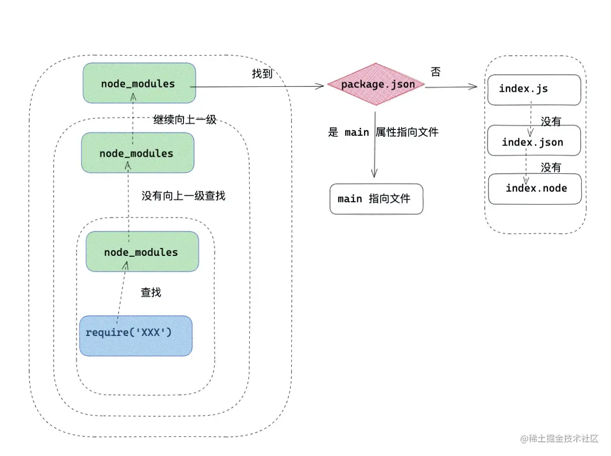
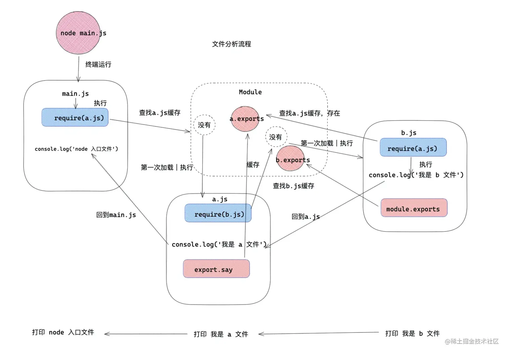

# 模块化
```js
1.script内会全局污染,3个js中有同名变量直接寄
<body>
  <script src="./index.js"></script>
  <script src="./home.js"></script>
  <script src="./list.js"></script>
</body>
2.依赖混乱，script中js执行从上到下，上层js中的方法无法调用下层js中的方法
```
# CommonJS
## 定义
1. commjs中每一个js为单独模块，称为module
2. 每个js都有核心变量exports, module.exports, require
```js
exports，module.exports负责导出内容
require负责导入其他模块
```
3. 原理
三者默认存在js中，可在所有js模块中直接使用
```js
module：记录模块信息
require: 引入模块方法
exports: 导出模块属性
```
编译过程中Commonjs对js进行首尾包装！
```js
(function(exports,require,module,__filename,__dirname)
```
4. require路径的三种方式
```js
1. 核心模块:fs，http，path等标识符
const fs = require('fs')
核心模块加载最快，仅次于缓存加载

2. 文件模块：
./ 和 ../ 作为相对路径的文件模块
/ 作为绝对路径的文件模块
const sayName = require('./hello.js')
文件模块编译后缓存，第二次复加载时快

3. 第三方自定义模块:非路径形式也非核心模块的模块
const crypto =  require('crypto-js')
自定义模块可能是包，在当前node_modules下查找，找不到向父级目录node_modules递归
先看package.json下的main属性指向文件
没有package.json看index.js/index.json/index.node
```


5. CommonJS执行阶段分析模块依赖采用深度优先遍历

```js
小module和大Module
module存在于每个模块上，保存单个模块信息
Module是整个系统控制所有模块的总信息
```

```js
1. 判断当前js有没有缓存
2. 无缓存则先加入缓存后执行模块内容文件
3. 循环引用时若检测已存在于缓存则读取数据
```
6. 动态加载
```js
const say = require('./a')
console.log('我是 b 文件')
console.log('打印 a 模块' , say)//此时取不到say方法，因为js顺序执行，得等这波运行完了才会加载a中的say方法

setTimeout(()=>{
    console.log('异步打印 a 模块' , say)
},0)//

module.exports = function(){
    return object
}
```
不在开头require，而是在函数中require：
```js
console.log('我是 a 文件')
exports.say = function(){
    const getMes = require('./b')
    const message = getMes()
    console.log(message)
}
由此可知require本质为一个函数，可以在任意上下文中加载其他模块
```
7. 为什么要一个一个exports.而不是exports={全部包住}
```js
因为js本身特性
function wrap (myExports){
    myExports={
       name:'123'
   }
}不行.print 123,相当于重新声明，此时传入的myExp和函数内myExp已经不一样了,不管传入什么都是123
function wrap (myExports){
    myExports.name='123'
}行. print abc
let a = {name:'abc'}
console.log(wrap(a))
```
8. module.exports是exports的总结
```js
exports.name = 'alien' // 此时 exports.name 是无效的
module.exports ={
    name:'《React进阶实践指南》',
    author:'我不是外星人',
    say(){
        console.log(666)
    }
}
```
exports会被初始化为对象，导出等于往上绑定属性，而module.exports更加自由
```js
let a = 1
module.exports = a // 导出函数
module.exports = [1,2,3] // 导出数组
module.exports = function(){} //导出方法
module.exports的风险，循环引用时对象不怕，因为会连接到相同的内存地址
但module.exp循环引用一个非对象的其他属性就有丢失属性的风险
```
# ESModule
ES6开始，官方下场的模块化规范
1. 静态导入导出可以实现tree shaking
2. export方式
```js
1. 正常导出
export { name, author }
export const say = function (){
    console.log('hello , world')
}
import { name , author , say } from 'XXX.js'
2. 默认导出
export default {
    name,
    author,
    say
} 
import anyName from 'XXX.js'
3. 混合导出
export const name = 'abc'
export const author = '123'

export default  function say (){
    console.log('hello, world')
}
import theSay, { name, author as  bookAuthor } from 'XXX.js'
import theSay, * as mes from 'XXX'//无.js
mes.say可以用！
4. 重要！重定向导出(用于整理不同js到同一个index.js)
//导出module中所有属性,不包括name中的default属性
export * from 'name' //方式1

//从name中原封不动的导出
export { name, author, ..., say } from 'name' //方式2

//从module中导入name，重属名为 bookName导出，从module中导入author，重属名为bookAuthor导出，正常导出say
export { name as bookName ,  author as bookAuthor , ..., say } from 'name' //方式3

5. 动态导入,需要wenpack配置
const promise = import('name')
```
## ES6 module特性
1. 静态语法，import会自动提升到代码顶层
```js
错误写法
function say(){
  import name from './a.js'  
  export const author = '我不是外星人'
}
```
2.1 commonjs同步加载和执行模块文件
2.2 es6提前加载和执行模块文件
3. 导出绑定，无法修改import导入属性
```js
import模块运行在严格模式
import导入变量为ReadOnly，默认const装饰不能被赋值
import导入变量与原变量之间的关系是引用的传递
```
4. import()动态引入
```js
import()返回一个promise对象
动态加载：
if(isRequire){
    const result  = import('./b')
}
懒加载：vue中的路由？
[
   {
        path: 'home',
        name: '首页',
        component: ()=> import('./home') ,
   },
]
```
5. tree shaking
```js
webpack中用于尽可能删除被import了但未使用的代码，记录之后不打包
```