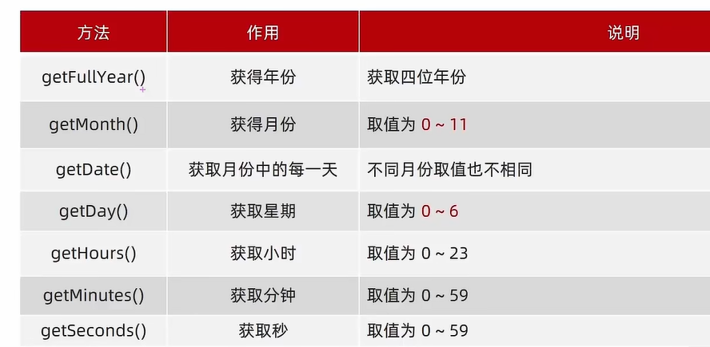
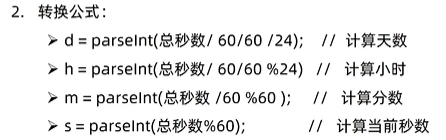
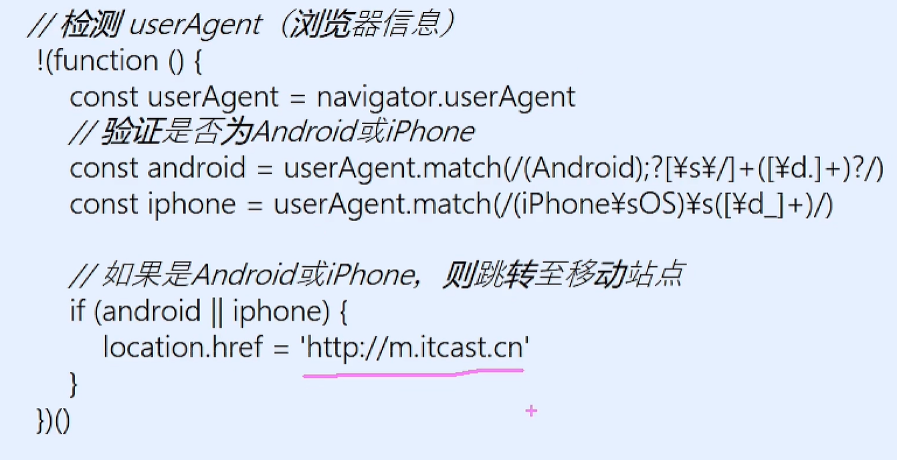
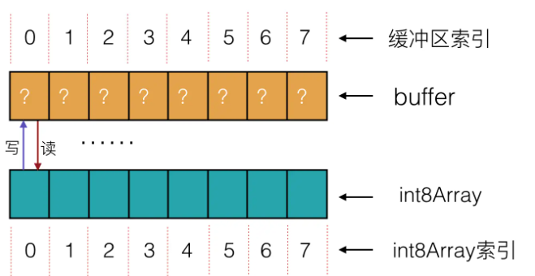
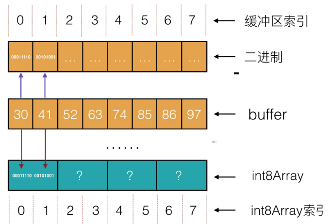

# JavaScript 学习笔记

## js 基础知识

1. 书写位置

```Js
//行内
直接在HTML标签内部写，Vue框架(略)
//内部
直接写在html文件中用Script标签包住
规范：Script标签要在</body>上面
<body>
先写HTML元素 <Button>等等
alert('警示框弹出')
<Script>
</Script>
</body>
//外部
通过Script标签从外部js文件引入
<body>
<Script src = "my.js">
//中间内容将被自动忽略
</Script>
</body>
```

2. 语句结尾可以加;也可以不加
3. 输入语法

```js
//文档输出内容
document.write("可以内含任何标签");
//页面输出(弹出对话框)
alert("内容");
//控制台日志
console.log("输出语法，调试用");
```

4. 输出语法

```js
//对话框输入
prompt("对话框输入语句");
```

5. 数据类型

```js
   当日志出现NaN时，表示其为不正确的数学操作结果
   当日志出现Undefined时，表示变量未定义(没有值)
   可以赋值null，表示赋值了，但内容为空(内容将来添加)
```

6. 字符串可以用``究极快速声明
7. 模板字符串

```js
//必须用反引号
let age = 18
document.write(`今年${age}`岁了)
//从此不用+age+
```

8. 检测数据类型

```js
typeof x  运算符
typeof(x) 函数
```

9. 类型转换

```js
prompt输入数据为string，计算需要先转换
//隐式转换
+号两边，只要有一个是字符串，另一个会被默认转换
除了+以外，全部运算符都转换成数字类型
sp：+号作为正号可以强制转换成数字型
//显示转换
Number(str)
parseInt(str) 只要整数，不会四舍五入，自动过滤字符串
parseFloat(str) 只要字符串
sp: parse两兄弟只会从左取，左边第一位是字母直接懵逼NaN
```

10. 算术运算符

```js
i = 1
console.log(i++ + ++i + 10) = 7
1++ + ++2 + 3
1 + 3 + 3
```

11. 三元运算符

```js
条件 ？ 代码1 ： 代码2
if ? true : false
```

12. 作用域

```js
函数内部变量无声明直接赋值，会被当做全局变量
```

13. 匿名函数

```js
//函数表达式，直接fn()，用于Web API
let fn = function(){}
//只能在函数体之后用，Error：未声明
(func(){})();
//立即执行的匿名函数
```

14. 逻辑中断

```js
console.log(false && age++);
console.log(true || age++);
//两个++都不执行
```

15. 查对象

```js
对象名.属性名;
对象名["属性名"];
```

16. 对象内方法(对象外就叫函数了)

```js
let obj = {
   uname: '德华'
   song: function(){
      console.log('冰雨')
   }
}
```

17. 遍历对象！！

```js
for (let k in obj) {
  console.log(k); //属性名
  //k是带引号的属性名
  console.log(obj[k]); //属性值
}
```

18. 内置对象 Math

```js
//有属性
Math.PI;
//有方法
Math.ceil(1.1); //向上取整
Math.floor(1.1); //向下取整
Math.random(); //[0,1)
Math.floor(Math.random() * (10 + 1)); //0-10
Math.floor(Math.random() * (5 + 1)) + 5; //5-10
Math.floor(Math.random() * (M - N + 1)) + N; //N-M
//全部为左闭右开
```

19 基本数据类型和引用数据类型

```js
//(栈中)简单数据类型，存值
string number boolean undefined null
//(堆中)复杂数据类型，存地址(引用)
Object Array Date
```

20. 变量声明 tips

```js
//声明变量const优先，需要变再改const
//复杂数据类型可以用const定义并且修改
//数组
const arr = ['red', 'pink']
arr.push('blue') //正确
arr = [1,2,4]    //错误
//obj同理
const obj = {}
·······
```

## APIs

### DOM/开发网页内容特效和实现用户交互

Document Object Model / 文档对象模型

1. DOM 树/文档树
   将 HTML 文档以树状结构表现
2. DOM 对象！
   所有 html 标签都是对象，拥有属性和方法
3. 获取 DOM 元素

```js
//曾经通过CSS选择器获取DOM元素
document.querySelector("css选择器"); //Get匹配的第一个元素
document.querySelector(".类名");

document.querySelectorAll("");
//取所有对象NodeList，返回对象合集，无法直接修改,是伪数组。
//有长度索引但无数组方法，只能通过for遍历的方式获得对象
```

4. 操作元素内容

```js
const 元素名 = doucument.querySelector(".box");
元素名.innerText = "只能修改文本，不解析标签";
元素名.innerHTML = "标签也能改";
```

```js
//通过修改属性改内容，比如图片
const img = document.querySelector("img");
img.src = "./######";
```

5. 操作元素样式属性

```js
const box = document.querySelector('.box')
box.style.width = '300px' //要有css单位，是字符串
box.style.backgroundColor = 'hotpink'
box.style.border = '2px solid blue' //边框
box.style.borderTop = '2px solid red'
document.body.style = ..... //body只有一个可以直接document.

//太多了可以用className直接操作css
预存css->.box{一堆属性}
const div = document.querySelector('div')
div.className = 'box'
//如果需要添加而不是替换，需要保留类名
div.className = 'nav box'
//直接添加
box.classList.add('active') //css中得提前准备.active
box.classList.remove('box')
box.classList.toggle('active') //切换,删除或添加
```

6. 自定义属性

```js
//HTML5新功能,data-自定义属性
//标签中一律以data-开头
//DOM对象中一律以dataset对象方式获取
```

7. 定时器-间歇函数

```js
网页中每隔一段时间需要自动执行一次，不需要手动触发
//有两种
let timer1 = setInterval(函数，间隔时间) //没过p2时间，执行p1
//函数名不加小括号
function fn(){}
let timer1 = setInterval(fn, 1000)
let timer1 = setInterval('fn()', 1000)
//关闭
clearInterval(id号/timer1)
```

8. 事件监听！！(重要)
   鼠标事件

```js
元素对象.addEventListener('事件类型', 执行的函数)
//三要素 源，类型，调用函数
//要获取的dom元素,事件类型(mouse，keyboard等),要做什么事
box.addEventListener('click', function())

//历史版本
DOM LO
事件源.on事件=function(){}
DOM L2
事件源.addEventListener(事件， 事件处理函数)
//on会被覆盖,addEventListener可以绑定多次
//冒泡->捕获
div.addEventListener('mouseenter', function(){###})
div.addEventListener('mouseLeave', function(){###})

mouseover/mouseout同上
但是会触发冒泡事件
```

焦点事件

```js
input.addEventListener('focus', function(){###})  //焦点触发
input.addEventListener('blur', function(){###})   //焦点失去
```

键盘事件

```js
input.addEventListener('keydown', func(){})
input.addEventListener('keyup', func(){})
```

文本事件

```js
input.addEventListener("input", function () {
  console.log(input.value); //用value来得到输入的值
});
```

9. 事件对象

```js
//一般命名为event, ev, e
//事件监听中绑定的回调函数的第一个参数
元素.addEventListener('click', func(event){})
//常用属性
type: 类型
clientX/clientY: 光标相对于浏览器窗口左上角的位置(左上角0,0?)
offsetX/offsetY: 光标相对于当前DOM元素左上角的位置
key: 用户按下的键盘值/现在不提倡keycode
元素.addEventListener('keyup', func(event){
   if(e.key === 'Enter'){###}
})
```

10. 环境对象

```js
即this指针，指向自己(函数的调用者)
const btn = document.querySelector('button')
btn.addEventListener('click', func(){
   this.style.color = 'red' //点了btn自己变颜色
})
```

11. 回调函数

```js
函数A作为参数传递给B函数时，不会立马执行，由B自动调用的函数
//例1
function fn(){###}
setInterval(fn, 1000)
//例2
box.addEventListener('click', function(){###})
```

12. 事件流

```js
事件捕获, 由父到子, 从外到内document开始;
DOM.addEventListener(事件类型, 处理函数, true);
事件冒泡, 由子到父, 从内到外;
DOM.addEventListener(事件类型, 处理函数, false / 不写也可属于默认值);
//当一个元素触发事件时，会依次向上触发所有父级元素的同名事件
阻止事件冒泡;
事件对象.stopPropagation(); //阻止事件流传播,同时阻止捕获和冒泡
son.addEventListener("click", function (e) {
  alert("####");
  e.stopPropagation();
});
解绑事件;
//old
btn.onclick = null;
//new
//匿名函数无法解绑，因为没得名字
function fn() {}
btm.addEventListener("click", fn);
btn.removeEventListener("click", fn);
```

13. 事件委托 + 事件对象

利用事件流/冒泡特性，减少元素注册次数

```js
//给父元素注册事件，出发子元素时会自动触发父元素事件(相当于子元素也触发)
ul.addEventListener('click', function(e){
   console.log(e.target) //获取点击的对象,此处ul中有数个子元素
   if( e.target.tagName === 'LI')//升级版，定位子元素名
})
```

14. 阻止默认行为
    事件.preventDefault;
    from.addEventListener('submit', func(e){
    e.preventDefault;
    //没写完,不让提交
    })
15. 其他事件

```js
//页面加载事件
window.addEventListener("load", function fn1() {
  //等待window所有加载，再function1
  img.addEventListener("load", function fn2() {
    //等待加载，然后再执行2
  });
});

//DOMContentLoaded事件，只等待初始HTML文档的完全加载和解析。无需等待样式表，图像的加载
document.addEventListener("DOMContentLoaded", function () {
  //操作
});

//页面滚动事件scroll
window.addEventListener("scroll", function () {});

//页面尺寸事件
//得到元素的宽高，包含边框
//得到元素的宽高，不包含边框
window.addEventListener("resize", function () {}).clientWidth.clientHeight //监听页面大小变化
  .offsetWidth.offsetHeight;
内容 +
  padding +
  //得到元素距离(带定位)父级元素(0,0)的offset
  border.offsetLeft.offsetTop;
```

16. 时间实例化

```js
关键字new
const date = new Date() //当前时间
const date1 = new Date('2023-8-11 15.02') //指定时间用于倒计时
date.gerFullYear()....
```



时间戳

```js
1970年01月01日开始的毫秒数,每个戳都是独特且不可回溯的
//唯一性
将来时间戳-当前时间戳=毫秒数->换算成时分秒=倒计时
//获取方法
const date = Date()
date.getTime() //方法函数
+new Date() //转换成数字
console.log(+new Date('2023-8-11 15.02')) //获得特定时间戳
Date.now() //不需要实例,且只能得到当前时间
```



17. 节点操作

```js
DOM节点->DOM树中的每一个内容都是
包括元素节点，属性节点，文本节点
元素节点：body, div, Html为根节点
```

查找节点新方法，以前是查找器，现在通过关系

```js
//父节点
子节点.parentNode; //返回对象或null
tip;
//子节点
父节点.childNodes; //获得所有的子节点，包括文本，注释等(非常多)
父节点.children; //属性！！获取全部元素节点，伪数组，只选亲儿子
//兄弟节点
this.nextElementSibling;
this.previousElementSibling;
```

增加节点

```js
//创建
const div = document.createElement("div");
//追加(父元素中最后一个)
父元素.appendChild(div);
//插入(最前)
父元素ul.insertBefore(li, ul.children[0]);
```

克隆节点

```js
元素.cloneNode(布尔值); //默认false, 不包含子节点。true， 包含子节点全部clone
```

减少节点

```js
//js中删元素必须经过父元素
父元素.removeChild(要删除的元素);
```

18. Mobile 端事件
    触屏 touch 事件

```js
div.addEventListener("touchstart", function () {}); //手指触摸到DOM元素时触发
touchmove; //手指在一个DOM元素上滑动时触发
touchend; //手指从一个DOM元素上移开时触发
```

19. 插件使用

```
1.熟悉官网，查看功能
2.看在线演示，找demo看符合度
3.学习基本使用流程
4.查看API文档，自行配置
//www.swiper.com.cn
```

### BOM/浏览器对象模型

```js
1.window对象是全局的，js中顶级对象(不能再高了)
2.document,alert(),console.log()这些都是window的属性
3.所有通过var定义在全局作用域(script中)的变量，函数都会变成window对象的属性和方法
4.window对象下的属性和方法调用时可以省略window
```

1. 定时器/延时函数

```js
let timer =setTimeout(回调函数，等待的毫秒数)
clearTimeout(timer)
//延时函数只执行一次,间歇函数不停间歇执行除非手动清除
```

2. JS 执行机制

```js
浏览器有两个引擎
1.渲染引擎HTML,CSS
2.解析引擎JS(google chrome -> V8)
```

3. EventLoop/事件循环/JS 语言本身是单线程!!

```js
HTML5提出Web Worker利用CPU计算能力允许JS脚本创建多线程，于是有了->
同步
异步->JS异步通过回调函数实现
1.普通时间:Click, resize
2.资源加载:load, error
3.定时器：setInterval, setTimeout
异步任务有自己的任务队列->
在同步任务执行栈全部完毕之后->
才读取异步任务->
并结束异步任务的等待状态->
进入执行栈
```

4. Location 对象

```js
location的数据类型是对象，它拆分并保存了URL地址的各个组成部分
1.href 获取完整URL地址，对其赋值可以用于跳转页面
location.herf = "www.####.com"
2.search 获取地址中携带的参数，?后面的部分，包括？
3.hash 获取地址中的哈希值#后面的部分
4.reload 刷新当前页面 location.reload(true) = 强制刷新
```

5. navigator 对象

```js
同上，数据类型是obj，此obj记录了浏览器自身的相关信息
1.userAgent检测浏览器版本及平台
```


!function(){}() = +function(){}() = ~function(){}() = (function(){})();

8. histroy 对象

```js
管理历史记录，操作浏览器后退前进等
1.back()
2.forward()
3.go(参数) 可前可后 go(1) go(-1)...
```

## 本地存储

1. 变量放内存里，一刷新就没了。HTML5 在浏览器中新增存储模块，掉电不丢失。5M 左右

```js
sessionStorage
生命周期到关闭浏览器为止
使用方法基本同下
localStorage
1.永久存储在本地(用户电脑中)
2.可以多窗口共享,同一浏览器共享
3.增删改查
localStorage.setItem(key, value) //以键值对的形式存储, 字符串要加引号
localStorage.getItem(key) //key名字要加引号
localStorage.removeItem(key)
查看从浏览器的Application->storage->local storage
```

2. 存储复杂数据类型

```js
首先需要将复杂数据类型转化为JSON字符串
const obj = {######}
localStorage.setItem('obj1', JSON.stringify(obj))
//JSON对象，所有引号统一双引号
const str = localStorage.getItem('obj')
console.log(JSON.Parse(str))
```

字符串拼接方法

```js
map方法，遍历数组数据并返回新的!!数组!!
const arr = ['red', 'blue', 'green']
const newArr = arr.map(function(ele, index)){
   console.log(ele) //数组元素
   console.log(index) //数组索引
   return ele + '颜色'
}
forEach()方法，遍历数组每个元素，无返回值，可以返回
//适合遍历数组对象，item直接是每个对象
arr.forEach(function(){item, index}) //index可省略
{
   console.log(item)
   console.log(index)
}
join方法
把数组中所有元素转化成一个字符串
console.log(arr.join('')) //连在一起
console.log(arr.join()) //用,分割
console.log(arr.join('.')) //用.分割
```

## 正则表达式 Regular Expression

1. js 中正则表达式是 Obj
2. 通常用来查找，替换符合正则表达式的文本
3. 验证表单，过滤敏感词(匹配，替换，提取)

```js
ex:用户名只能包含英文字母，数字，或者下划线
/^[a-z0-9_-]{3,16}$/
```

4.语法

```js
const str = "学习前端，嘻嘻哈哈";
const 变量名 = /表达式/;
const reg = /前端/; //直接写规则RegExp
规则变量名.test(被检测的字符串); //检测是否符合，此方法有返回值
console.log(reg.test(str)); //包含规则内表达式，则返回true

规则变量名.exec(被检测字符串); //查找/检索，返回数组，没有返回null
```

5. 元字符/特殊字符

```js
一些具有特殊含义的字符，提高灵活性和匹配功能
1. [a-z][a-zA-Z0-9-_]
2. 参考文档MDN或者tool.oschina.net/regex
3. 边界符/位置符(精确匹配)
^     //匹配行首的文本(开始)
$     //匹配行尾的文本(结束)
*     //重复0次或更多次
+     //重复1次或更多次
?     //重复0次或1次
{n}   //重复n次
{n,}  //重复n次或更多次
{n,m} //重复n到m次
console.log(/^哈/.test('哈哈'))     //true
console.log(/^哈/.test('二哈'))     //return false
console.log(/^哈$/.test('哈哈'))    //false
console.log(/^哈哈$/.test('哈哈'))  //true
console.log(/^哈*$/.test('哈哈'))   //true
4. 字符类
[]    //匹配字符集合,只要包含任何一个字符都返回true
\d    //0-9的简写模式
\D    //0-9以外的简写模式
\w    //任意字母，数字，下划线
\W    //除了上面的之外
\s    //匹配空格(包括换行 制表 空格符 \t\r\n\v\f)
\S    //匹配非空格
```

5. 修饰符

```js
/表达式/修饰符
console.log(/a/i.test('a'))  //i = ignore 不区分大小写
//g = global 匹配所有满足表达式的结果

const result = str.replace(/java/i, '前端') //把所有java换成前端,无论大小写
```

## js 进阶

1. 作用域 scope/ES6 的新写法

```js
1. 函数的参数也是函数内部的局部变量
2. 有大括号的都是块作用域，都是局部情况
//但是只有const和let声明的会生成块作用域，var声明的是全局
3. 垃圾回收机制Garbage Collection
内存分配->内存使用->内存回收(垃圾回收器)
//全局变量关闭页面才自动回收，局部变量立刻回收
引用计数法 //IE浏览器 看对象是否有指向它的引用，没了就回收、
//跟踪被引用的次数++or--
const arr = [1,2,3,4]
arr = null //地址->null 释放
//嵌套引用/循环引用有BUG
function fn(){
let o1 = {}
let o2 = {}
o1.a = o2
o2.a = o1
}
fn()
//互相存直接->BUG
//每次调用都会产生新的，导致越来越多
标记清除法 //定义无法到达的对象为不再使用的对象
从根部寻找所有对象
4. 闭包closure = 内层函数 + 外层函数变量
function outer(){
   let a = 1
   function f(){
      console.log(a)
   }
} //里层函数用到了外层函数的变量->合二为一
想让外部函数访问内部函数变量时，可以通过闭包实现，return内部变量
function outer(){
   let a = 1
   function f(){
      console.log(a)
   }
   return fn
}
outer() === fn === function fn(){}
const fun = outer()
fun() //外部Fun调用outer内部的fn函数
//统计调用次数
5. 变量提升
只存在var的情况, 会把var声明自动提升到当前作用域的最前面(赋值不会提升)
6. 函数提升
函数会提升，函数表达式不会
bar() //报错
var bar = function(){}
7. 动态参数
不知道参数数量的情况下,获取所有参数
//关键词arguments, 只存在函数中(伪数组)
function getSum(){
   let sum = 0
   for(let i = 0; i < arguments.length; i++){
      sum += arguments[i]
   }
}
8. 剩余参数
将不定参数表达成一个数组
function getSum(a, b, ...arr){}
9. 展开运算符
Math.max(...arr1)
Math.min(...arr2)
不会修改内容
10. 箭头函数
//const fn = function(){}
const fn = () => {}
const fn = x => {}  //只有一个参数,可省略括号
const fn = x => console.log(x) //只有一行可以省大括号
const fn = x => x + x //可以省return
const fn = (uname) => ({uname: uanme}) //属性值：属性名 相同时可省略
箭头函数没有arguments参数
const getSum = (...arr) => {
   let sum = 0
   for (let i = 0; i < arr.length; i++){ sum += arr[i]}
   return sum
}
箭头函数不会创建自己的this指针, 只会从上一层沿用相同的this
btn.addEventListener('click', () => {console.log(this)}) //this => window
btn.addEventListener('click', function(){console.log(this)}) //this =>DOM对象
```

2. 解构赋值

```js
1.数组解构
是将数组单元值批量赋值给一系列变量的简洁语法
const arr = [1, 2, 3]
const [min, avg, max]= arr //批量声明
let a = 1
let b = 2; //此处;必须
[b,a] = [a,b]
//立即执行的函数必须要加;
//(function(){})()
const [a = 0,b = 0, ,...c] = [1,2,3,4, 5]
const [a, b, [c, d]] = [1, 2, [3, 4]]
2.对象解构
将对象的属性和方法快速赋值给一系列变量的简介语法
const user = {
   name : 'xinzz',
   age : 16
}
const {name : uname, age} = user
//改名
console.log(uname)
3.数组对象
const pig = [{
   unname : 'peiki',
   age : 6
}]
const [{uname, age}] = pig

//究极解构
function render({data: myData}){
   console.log(data)
}
render(msg) //msg对象中中有ID, 名称, 以及data数组对象
```

3. 构造函数

```js
创建对象的三种方式
1.const pig = {name: 'peiki'}
2.const pig = new Object({name: 'peiki'})
3.构造函数首字母要大写Captial
function Pig(name, age, gender){
   this.name = name //静态属性
   this.age = age
   this.gender = gender
   this.walk = () => { walk } //静态方法
}

const p = new Pig('peiki', 16, girl)
p.father = peipidad //实例属性
p.sayhi = () => {console.log('hi``')} //实例方法
```

```js
内置构造函数
基本数据类型str,num,boolean等有专门的构造函数(因为有方法),称其为包装类型
1.Object //const o = {name= 'peiki', age: 16}
Object.keys(o) //获得所有属性名,返回数组['name','age']
Object.values(o) //获得所有属性值['peiki',18]
const oo = {}
Object.assign(oo, o) //拷贝对象
Object.assign(o, {gender: 'girl"}) //增加对象属性, 多个实例对象合并也可以
2.Array
实例方法
forEach,map
filter: 返回满足筛选条件的数组元素组成的新数组
reduce: 返回累计结果，用于求和
arr.reduce(function(上一次值, 当前值){}, 起始值) //起始值可以省略
const arr = [1, 5, 8]
const total = arr.reduce(function (prev, current){
   return prev + current
}) //14
const total = arr.reduce(function (prev, current){
   return prev + current
}, 10) //24
const total = arr.reduce((prev, current) => prev + current, 10)
其他方法
find: 查找元素 //返回第一个符合条件的元素值
findIndex: 查索引
every: 检测全体元素是否都符合条件,返回true和false
some: every的部分版本，至少有一个就行
sort: 排序
reverse: 反转
静态方法
liss = Array.from(lis) //伪数组转换为真数组
3.String
length, split('分隔符')
substring: 截取
startsWith, endsWith: 检测是否以某字符开头,结尾
includes：检测是否包含某字符串
toUpperCase, toLowerCase: 大小写转换
indexOf: 检测是否包含某字符
replace: 替换，支持正则
match: 查找，支持正则
4.Number
toFixed(1) :设置保留的小鼠位数，四舍五入，默认整数
```

4. 面向对象(特点：封装，继承，多态)

```js
1.构造函数的方法在创建对象时会重复进入堆，浪费内存--->原型prototype
2.构造函数通过原型分配的函数被所有对象共享
3.js规定每一个构造函数都有一个prototype属性指向一个单独的对象，称之为原型对象
4.次对象可以挂载函数，不会重复创建
5.构造函数和原型对象中的this都指向实例化之后的对象自己
function Star(name, age){略
Star.prototype.sing = function(){唱}
6.每个原型对象中都有constructor属性
该属性指向该原型对象的构造函数
Star.prototype = {
   constructor: Star,
   sing: function(){},
   dance: function(){}
}
7.对象原型
实例对象有一个属性_proto_===[[Prototype]]//浏览器中显示为这个
指向prototype原型对象，从而可以使用共享的属性和方法
const ldh = new Star()
console.log(ldh.__proto__ === Star.prototype)
8.原型继承
const Person = {####}
function Woman = {###}
//Woman继承Person
Woman.prototype = Person //不行，直接连接的地址，改动Woman会影响上级
Woman.prototype.constructor = Woman //重新连接

//以下为正确写法
Woman.prototype = new Person()
Woman.prototype.constructor = Woman
9.原型链
基于原型对象的继承使不同构造函数的原型对象关联在一起
所有的对象最终归属Object，都可以在其原型中找到__proto__指向上层原型 //对象实例，原型对象都是对象
Array.prototype.map()
10.instanceof运算符
console.log(ldh instanceof Person)
console.log(ldh instanceof Object)
console.log(Array instanceof Object)
返回一个boolean值
```

5. 高阶技巧

拷贝相关

```js
浅拷贝 //拷贝的是地址
Object.assgin()
Array.prototype.concat()
const obj = {
   uname: 'abc',
   age: 18
}
const o = {...obj}
const o = obj

深拷贝
1.递归 //函数内部调用自己的函数叫递归函数，注意stack overflow需要加入推出条件return
function deepCopy(newObj, oldObj){
   for(let k in oldObj){
      if(oldObj[k] instaceof Array){
         newObj[k] = []
         deepCopy(newObj[k], oldObj[k])
      }
      else if(oldObj[k] instanceof Object){
         newObj[k] = {}
         deepCopy(newObj[k], oldObjp[k])
      }
      else{
      newObj[k] = oldObj[k]
      }
   }
}
deepCopy(o, obj)
//一定要先写array再写object，因为array属于object
//只覆盖了60%的适用范围
2.lodash
var newObj = _.cloneDeep(oldObj)
3.利用JSON
//把对象转换为JSON字符串，变成简单数据类型
JSON.stringify(oldObj)
//再转换成对象
const newObj = JSON.parse(JSON.stringify(oldObj))
```

异常处理

```js
1.thorw抛异常
//抛出后程序会终止运行，配合error可以手动设置更详细的信息
throw new Error('想要说的信息')
2.try/catch/finally //预知错误提前检测
function fn() {
   try {
      //写可能有错误的代码
   } catch(err){
      //拦截/提示/不中断程序
      console.log(err.message)
      //手动中断加return
      //或配合throw new Error('####')
   }
   finally{
      //不管对不对都会执行的代码
      alert('弹出')
   }
}
3.debugger
//加入断点
```

开启严格模式

```js
<script>'use strict' //第一行</script>
```

this 指针

```js
1.普通函数的this指向 //严格模式下指向undefined
2.箭头函数的this指向 //本身不存在this，实际上指向上一层作用域
btn.addEventListener('click', ()=>{console.log(this)}) //指向window
btn.addEventListener('click', function(){console.log(this)}) //指向DOM
基于原型的面向对象也不推荐采用箭头函数
function Person(){}
Person.prototype.walk = () =>{
   console.log(this); //指向window
}
const p1 = new Person() //p1中的this指向window
3.改变this指向
//call() 调用函数的同时，指定this指针的指向
const obj = {}
function fn(x,y){} //window
fn.call(obj,1,2) //obj

//apply()
fn.apply(obj, [1, 2]) //p2要放数组
const arr = [1,2,3]
const max = Math.max.apply(Math, arr) //p1可以null
Math.max(...arr) //同上

//bind() 不调用函数，语法与call相似
拷贝原函数，并改变其this指向
const fun = fn.bind(obj) //从window->obj
```

性能优化

```js
1.debounce防抖
//单位时间内频繁触发的事件，只执行最后一次
//触发后，执行中的会中断，开始新一次的执行
lodash提供：_.debounce(func, [wait = 0], [options=]) //函数，时间，
手写：利用setTimeout定时器
function debounce(fn, t){
   let timer
   return function(){
      if(timer)clearTimeout(timer)
      timer = setTimeout(function(){
      fn()
      }, t)
   }
}
2.throttle节流
//单位时间内只执行一次，未完成之前，无视新的触发
lodash提供：_.throttle(func, [waite = 0], [options=])
手写：利用setTimeout定时器
function throttle(fn, t){
   let timer = null
   return function(){
      if(!timer){
         timer = setTimeout(function(){
            fn()
            timer = null
            //不用clearTimeout的原因，运作期间无法清除
         }, t)
      }
   }

}
```

1. others
   with 语句

```js
let qs = location.search.substring(1);
let hostName = loaction.hostname;
let url = location.href;
//升级后
with (location) {
  let qs = serach.substring(1);
  let hostName = hostname;
  let url = href;
}
```

## JSDoc 文档注释

```js
1. 开头和结尾
/** 开头
* 可以插入单个星号用于美观和对齐
* 可以插入@标签来解析特定参数的文档注释
*/ 结尾
//放置于需要标注的函数.类.变量等成员之前
2. 系统首先计算成员列表
如果有import/export则使用export的成员才会被列出
否则所有全局成员会被列出
被标记为 /** @private */ 的私有成员会被默认忽略
标记 /** @ignore */ 可以手动忽略任何成员
3. 标签
@summary 默认标签，一句话解释
@description。@desc。@remarks 详细说明成员的用法，原理
@example 用于编写用法示例
@see。@link 指定和当前成员相关的参考链接
@deprecated 指定当前成员已废弃，未来版本将删除
@since 指定首次添加当前成员的版本号，提示必须在升级至指定版本后才可使用
@experimental。@beta 提示当前成员正在beta阶段
@category 指定成员分类，在文档中相同分类成员会放在一起，且添加标题
@ignore。@hidden。@todo 文档中隐藏当前成员
4. 修饰符标签
@public 提示当前成员的状态为公开(默认)
@protected 指示当前成员只能在当前类以及子类中使用
@private 指示当前成员只能在类内部使用，默认不会在文档中显示
@internal。@package 指示当前成员仅供内部使用。JS中下划线开头的成员默认为内部成员
@access 指定可访问性，后接public，protected，private，internal，package
@final。@sealed 指定当前成员不可继承
@readonly 变量只读表示常量。字段只读表示内部写外部读。函数只读表示没有副作用。类只读表示不可变类immutable
@abstract 指定当前成员是抽象的，期望被继承
5. 特定成员标签
@param 指定参数的说明 @param{类型}参数名 参数说明
@param(ts) 只需要接变量名即可关联@param 参数名 参数说明
@param 可以接callback.参数名/return 解释回调函数的参数，返回值等
@return。@returns 指定函数返回值的说明
@template。@typeparam 指定类型参数的说明，泛型或函数用T
@type 指定变量或字段的类型
@default 指定变量或字段的默认值
6. 文档级标签
@fileoverview。@file 指定当前文件的用途说明
@author 指定当前文件的作者 名字<邮箱>(主页地址)
@license。@licence 当前文件的开源协议
@copyright 当前文件的版权声明
@created 当前文件的创建时间
@modified 当前文件的最后修改时间
@version 当前文件的版本号
@module 当前文件是一个AMD/CommonJS/ES6模块
7. 内联标签
{@link} 可以链接到其他API页面
{@link #成员名} 链接到同文件其他成员
{@link #相对源码地址#成员名} 链接到其他文件的其他成员
8. 文档继承
@inheritdoc 对子类成员，文档可以自动继承父类
```

## Js 模块导入

```js
1. 导入整个模块
import * as myModule from "/modules/my-module.js";
2. 导入单个接口
import { myExport } from "/modules/my-module.js";
3. 导入多个接口
import { Export1, Export2 } from "/modules/my-module.js";
4. 导入接口时改名
import { Export1 as newName } from "/modules/my-module.js";
5. 导入复数接口时改名
import { Export1 as newName1, Export2 as newName2} from "/modules/my-module.js";
6. 仅导入运行模块，但不导入任何接口
import "/modules/my-module.js";
7. 导入默认值
import myDefault from "/modules/my-module.js";
import myDefault, * as myModule from "/modules/my-module.js";
8. 动态导入
import("/modules/my-module.js").then((module) => {
  // Do something with the module.
}); //返回一个Promise
let module = await import("/modules/my-module.js");
```

## Js 模块导出

```js
1. 命名导出
export let name1, name2, …, nameN;
export class ClassName {...}
export function FunctionName(){...}
2. 列表导出
export { name1, name2, …, nameN };
export { variable1 as name1, variable2 as name2, …, nameN };
3. 默认导出//OnlyOne
export default expression;
export default function functionName() { /* … */ }
export default class ClassName { /* … */ }
export { name1 as default, … };
4. 合集导出
export * from "module-name";
export * as name1 from "module-name";
export { name1, /* …, */ nameN } from "module-name";
export { import1 as name1, import2 as name2, /* …, */ nameN } from "module-name";
```

## Promise

```js
最简单例子;
const promise = createAudioFileAsync(audioSettings);
promise.then(successCallback, failureCallback);
简写为;
createAudioFileAsync(audioSettings).then(successCallback, failureCallback);
```

Promise 在 JS 中可以更好的管理异步代码

```js
三种状态
1.Pending进行中
2.Fulfilled完成
3.Rejected拒绝
执行成功返回.then()中的回调函数
执行失败返回.catch()中的回调函数

Promise链
通过串联多个.then()来组合异步操作
每个.then()都会返回新的Promise可以继续.then()
所有链中Promise共享一个.catch()错误捕捉

const promise1 = doSomething();
const promise2 = promise1.then(successCallback, failureCallback);
简写为
const promise2 = doSomething().then(successCallback, failureCallback);
```

回调地狱->Promise->async/await

```js
getData(function (data1) {
  getMoreData(data1, function (data2) {
    getMoreData(data2, function (data3) {
      // ...
    });
  });
});

getData()
  .then((data1) => getMoreData(data1))
  .then((data2) => getMoreData(data2))
  .then((data3) => {
    // ...
  })
  .catch((error) => {
    // 处理错误
  });

try {
  const data1 = await getData();
  const data2 = await getMoreData(data1);
  const data3 = await getMoreData(data2);
  // ...
} catch (error) {
  // 处理错误
}
```

Promise 组合技/静态方法

```js
Promise.all()
并行操作func123，之后再进行result123
Promise.all([func1(), func2(), func3()]).then(([result1, result2, result3]) => {
  /* use result1, result2 and result3 */
});
Promise.allSettled()
all()是一个错误就立即rejected，allSettled()会执行完所有Promise并返回所有结果(通过迭代取值)

Promise.resolve()
将非Promise的数据或返回值转化为Promise对象，可以继续在后续进行链式调用
如果传入参数为Promise对象，它将维持原样返回，否则返回一个新的Promise

Promise.reject()
返回一个已拒绝的Promise对象，并将Rejected Value作为拒绝的原因
const rejectedPromise = Promise.reject('Rejected Value');
rejectedPromise.catch(error => {
    console.log(error); // 输出 'Rejected Value'
});

Promise.race()
类似all()，但是可以在首个Promise对象resolve或reject时立即返回一个new Promise Object
常用于处理有竞争关系的多个异步操作，只对第一个出现的结果感兴趣
note:传入的对象中包含非Promise对象时，会被自动转化为Promise对象然后比较

Promise.any()
任意一个Promise被resolved时resolved,仅在所有Promise都被Rejected时才Rejected
```

async/await

```js
async关键字用于声明函数是异步的
被async标记的函数会返回一个Promise对象
await关键字只能再被async标记的函数内部使用
用于暂停函数的执行，等待Promise对象的执行完成
```

配合 try/catch 捕获可能出现的错误

```js
async function getData() {
  try {
    const response = await fetch("https://api.example.com/data");
    const data = await response.json();
    return data;
  } catch (error) {
    console.error("Error fetching data:", error);
  }
}

getData();
```

## function\*

1. function\* 是 Generator Function(生成器函数)的声明方式
2. 调用生成器函数并不会立即执行，而是返回一个 Generator(迭代器)对象，当 Generaator.next()方法被调用时，语句开始执行直到 yield 的位置，然后返回一个值 value
3. next.()整体返回一个对象(value, done)即(yield 表达式的返回值，Boolean 确认之后区域是否还有 yield 语句)
4. 主要特点是在运行时能暂停，之后还能从暂停处继续执行
5. yield\*写法会将执行权移交给另一个 Generator Function(当前暂停)

```js
在函数体中可以使用yield关键字返回一系列的值，而不是只有一个Return
function* simpleGenerator() {
  yield 1;
  yield 2;
  yield 3;
}

const generator = simpleGenerator();

console.log(generator.next()); // { value: 1, done: false }
console.log(generator.next()); // { value: 2, done: false }
console.log(generator.next()); // { value: 3, done: false }
console.log(generator.next()); // { value: undefined, done: true }

//！！注意！！
GeneratorFunc是惰性的，只有next()调用时才会执行属于下一块yield的代码
```

## JS 二进制读写

### 1.创建一个内存区域

```js
let buffer = new ArrayBuffer();
//这个指向的内存长度是 0 字节，无意义
let buffer = new ArrayBuffer(8);
//指向/定义 8 字节长度的内存
//但是这八个位置存的都是undefined
```

### 2.八大金刚



```js
Int8Array：8位有符号整数，1个字节长度。
Uint8Array：8位无符号整数，1个字节长度。
Int16Array：16位有符号整数，2个字节长度。
Uint16Array：16位无符号整数，2个字节长度。
Int32Array：32位有符号整数，4个字节长度。
Uint32Array：32位无符号整数，4个字节长度。
Float32Array：32位浮点数， 4个字节长度。
Float64Array：64位浮点数，8个字节长度。

通过 Array 做中介进行数据交换
let int8Array = new Int8Array(buffer);
int8Array[0-7] = 读写Buffer0-7位数据

8位Buffer配16位Array时
let int16Array = new Int16Array(buffer);
两个字节长度即16位01数据组合成的十进制数将被转换成整数
```


