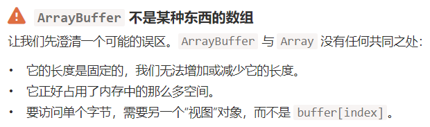
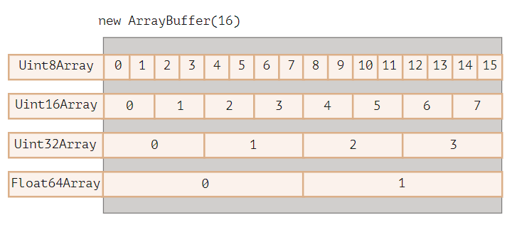

# 二进制数据各种基础知识

## ArrayBuffer 二进制数组

在 Web 开发中，当我们处理文件时（创建，上传，下载），经常会遇到二进制数据。另一个典型的应用场景是图像处理。

这些都可以通过 JavaScript 进行处理，而且二进制操作性能更高。

不过，在 JavaScript 中有很多种二进制数据格式，会有点容易混淆。仅举几个例子：

ArrayBuffer，Uint8Array，DataView，Blob，File 及其他。
与其他语言相比，JavaScript 中的二进制数据是以非标准方式实现的。但是，当我们理清楚以后，一切就会变得相当简单了。

#### 基本二进制对象 ArrayBuffer

对固定长度连续内存空间的引用

```js
let buffer = new ArrayBuffer(16); // 创建一个长度为 16 的 buffer
alert(buffer.byteLength); // 16
```



#### 利用视图对象操作 ArrayBuffer



```js
let buffer = new ArrayBuffer(16); // 创建一个长度为 16 的 buffer
let view = new Uint32Array(buffer); // 将 buffer 视为一个 32 位整数的序列

alert(Uint32Array.BYTES_PER_ELEMENT); // 每个整数 4 个字节
alert(view.length); // 4，它存储了 4 个整数
alert(view.byteLength); // 16，字节中的大小
```

#### 所有视图统称为 TypedArray

无统一构造器，只是统称

```js
五种参数形式;
new TypedArray(buffer, [byteOffset], [length]);
new TypedArray(object);
new TypedArray(typedArray);
new TypedArray(length);
new TypedArray();
```

1.数据, 起始位置偏移, 长度

2.复制内容,创建相同长度的 TypedArray

3.转换类型

4.元素数\*元素长度

5.长度为 0

#### 越界行为

长度超了, 不会报错, 但会被切除

#### TypeArray 方法

可以遍历同 array(map, slice, fine, reduce)
无法删除 splice(因为是 Buffer 上存在的固定连续的内存区域,能做的只有给个 0 值)
另外有两个小方法

```js
arr.set(fromArr, [offset]) 从 offset（默认为 0）开始，将 fromArr 中的所有元素复制到 arr。
arr.subarray([begin, end]) 创建一个从 begin 到 end（不包括）相同类型的新视图。这类似于 slice 方法（同样也支持），但不复制任何内容 —— 只是创建一个新视图，以对给定片段的数据进行操作。
```

#### DataView 超灵活视图

可以任意格式访问任意偏移开始的连续数据

```js
new DataView(buffer, [byteOffset], [byteLength]);
```

buffer 可以是任何类型的 TypedArray.buffer,只要他底层符合 ArrayBuffer 即可

```js
let buffer = new Uint8Array([255, 255, 255, 255]).buffer;
//注意不能直接给array奥，要.buffer给buffer
let dataView = new DataView(buffer);
```

在多种混合格式数据被储存在同一缓冲区 Buffer 中时非常有用